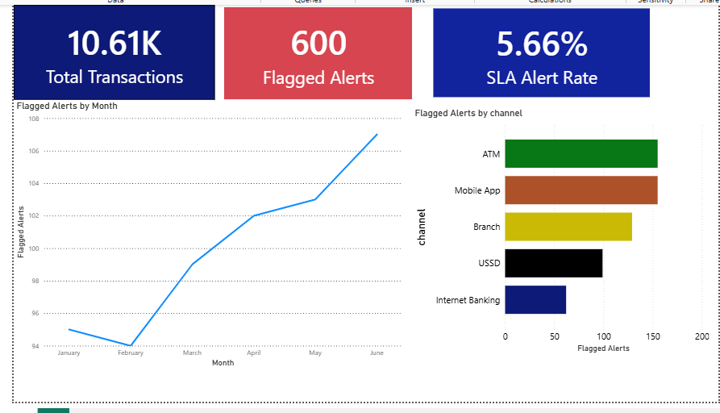

# Financial Transaction Anomaly Detection & AML Triage Engine

An end-to-end data analytics and business intelligence project that builds an automated rule-based anomaly detection engine in Python and translates high-risk patterns into an executive-level Power BI triage dashboard.

## 📌 Project Overview
In modern retail banking, manual review of transactions is scale-prohibitive, leading to high operational lag and increased vulnerability to financial crimes. This project bridges the gap between raw backend transaction logs and proactive risk mitigation. 

By executing complex data engineering pipelines and multi-layer logical testing in **Python**, the engine parsed **10,605 financial transactions**, isolating a core subset of **600 high-risk anomalies** (representing a **5.66% SLA Alert Rate**). The output was then modeled into an interactive **Power BI Dashboard** designed for compliance officers to investigate operational risk concentrations.

---

## 🛠️ Tech Stack & Architecture
* **Data Pipeline & Engineering:** Python 3.x (Pandas, NumPy)
* **Business Intelligence & Analytics:** Power BI Desktop (DAX Modeling)
* **Development Environment:** Jupyter Notebook / VS Code

---

## ⚙️ Core Technical Implementation

### 1. Python Backend Rule Engine
The transaction records were evaluated against four distinct operational risk parameters to capture anomalies across various vulnerability vectors:
* **Statistical Outliers:** Transactions deviating by more than 3 standard deviations ($> 3\sigma$) from the historical user mean.
* **Off-Hours High-Value Withdrawals:** Structural cash movements exceeding risk thresholds conducted outside core banking processing windows (00:00 - 04:00 AM).
* **Velocity Transfers:** Rapid, sequential multi-account transfers executed within a strict 10-minute automated window.
* **Round-Tripping Circular Loops:** Layering patterns where funds originate and return to the primary account through intermediary nodes within a tight ±2% variance threshold.

### 2. Power BI DAX Metrics Layer
To enable dynamic cross-filtering and sub-second calculation speeds, custom Data Analysis Expressions (DAX) measures were established:
```dax
Total Transactions = COUNT(final_flagged_transactions[transaction_id])


Flagged Alerts = SUM(final_flagged_transactions[final_predicted_anomaly])

SLA Alert Rate = DIVIDE([Flagged Alerts], [Total Transactions], 0)

🔍 Key Data-Driven Insights & FindingsAnalysis of the operational dashboard reveals clear systemic risk trends across the bank's processing landscape:Escalating Quarter-over-Quarter Risk: Flagged anomalies experienced a steady upward trajectory throughout the first half of the year, surging from an annual low of 94 cases in February to a peak of 107 cases in June. This signals a coordinated shift in malicious traffic or structural gaps in transaction boundaries during Q2.High-Risk Channel Concentration: Vulnerabilities are highly localized. ATM and Mobile App channels are the primary vectors for illicit or anomalous activity, contributing roughly 155 flags each. Conversely, Internet Banking remains the most secure infrastructure node with minimal flag generation (~62 cases).💼 Strategic Business RecommendationsBased on the visual intelligence compiled from this engine, the risk management team should deploy the following mitigation controls:Deploy Step-Up Authentication on Vulnerable Channels: Implement real-time multi-factor authentication (MFA) and biometric challenges specifically targeting transactions originating from Mobile Apps and ATMs that cross the $2\sigma$ monetary volume thresholds.Conduct a Q2 Operational Audit: Launch a specialized investigation into the underlying causes of the transaction volume and anomaly escalation observed between February and June to determine if an external system breach or a new structural vulnerability is being exploited.Triage Queue Optimization: Reallocate compliance specialist staffing away from Internet Banking audits to actively clear the high-density ATM and Mobile App anomaly queues, keeping operational response within internal SLA targets.
